# This file will contains the notes for the study material of the ceritification

## $${\color{yellowgreen}Section-2 - GenAI \space Primers \space and \space Fundamentals}$$

### $${\color{darkorange}Lecture 1 - The \space Synergistic \space Co-existence \space of \space Predictive \space and \space Generative \space AI}$$
#### Definition of AI and ML:

- AI is described as machines performing tasks that typically require human intelligence.
- ML is identified as a subset of AI that allows computers to learn from data without needing explicit programming.

  
#### Machine Learning:
The development of models using algorithms, such as logistic regression and linear regression, that are trained on datasets to make predictions. This is crucial for applying AI in real-world business scenarios.

#### Generative AI:
A deep learning subset that generates new content (text, images, or audio) based on prompts, capable of delivering diverse outputs from identical inputs.

#### Predictive AI:
Models designed to make accurate predictions based on historical data, essential for tasks like forecasting house prices or identifying objects in images.

#### Large Language Models (LLMs):
Examples like GPT-4 that leverage deep learning to process language and produce human-like text. The training of these models is complex, requiring vast computational power and billions of parameters.

#### Use Cases:
Illustrates practical applications, such as in airports where predictive AI can forecast delays, and generative AI can improve customer service through interactive chatbots.

#### Integration of AI Models:
Emphasizes the necessity of combining both custom-built and pre-built AI models to effectively address business problems, suggesting that companies leveraging both types of AI will gain a competitive edge.

### $${\color{darkorange}Lecture 2 - Introduction \space to \space AI \space Agents \space and \space Compound \space AI \space Systems}$$
#### Compund AI Systems:
Compound AI systems are systems that tackle AI tasks by combining mulitple interacting components. simply put these systems integrate multiple interacting components to automate business processes and workflows. They aim to deliver better returns on investment (ROI) in AI technologies over traditional uses.

#### AI Agents
AI agents are a specific type of compound AI system. They enhance the functionality of foundational large language models (LLMs) by allowing them to call APIs and interact with external systems.

#### Evolution of AI Agents:
The journey began in 2021 with the introduction of ChatGPT, focusing initially on creating basic chatbots utilizing LLMs and API calls. The demand for improved ROI led to AI agents which can dynamically plan and execute actions.

#### User Intent Understanding:
AI agents use natural language processing to understand user intent, enabling them to plan actions at runtime instead of relying on hardcoded logic typical of traditional software systems.

#### Autonomy and Dynamic Planning:
The key distinguishing feature of AI agents is their autonomy in planning and executing tasks based on user queries, as opposed to fixed if-else statements found in traditional enterprise software.

#### Components of an AI Agent:
An AI agent comprises an LLM, a set of behavioral instructions, and tools for actions and retrieval. The LLM's capacity to autonomously plan the execution of these tools based on user intent is crucial for efficient automation.

### $${\color{darkorange}Lecture 3 - GenAI \space Jargons: \space Key \space Terminologies}$$
#### Tokens:

#### System Prompts and User Prompts:

#### Chat Completion API:

#### Multi-Modality and Multi-Modal Models:

## $${\color{yellowgreen}Section-3 - GenAI \space Development \space with \space Microsoft \space Foundary}$$

### $${\color{darkorange}Lecture 5 - Introduction \space to \space Microsoft \space Foundary}$$
#### What is Microsoft Foundary:
Microsoft Foundary is Microsoft's AI ecosystem, it's a platform as a service. It has a number of components what can be leveraged to build and deploy AI application as below -

<ul>
  <li>Model Catalog: Allows deploying AI models without infrastructure concerns.</li>
  <li>Agent Service: Facilitates the creation and management of AI agents.</li>
  <li>Foundry IQ: Integrates enterprise knowledge for better performance.</li>
  <li>Control Plane: Provides observability by monitoring agent performance.</li>
  <li>Development Flexibility: Supports both cloud-native and local development of agents.</li>
  <li>Security and Compliance: Features like agent IDs and integration with Microsoft Purview ensure data protection.</li>
</ul>

Microsoft Foundary has a number of tools that can be leveraged, a few of them as available below -

### $${\color{darkorange}Lecture 6 - Difference \space between \space Hub-Based \space Project \space and \space Standalone \space Projects}$$
#### High level differences:

#### Hub based project hierarchy:

<ul>
  <li>AI Hub is kind of the central project and is at the organization level. Any connections created at the Hub have a trickle down effect on all the project</li>
  <li>Project are kind of spokes under the AI Hub. Any connections created at the project is only application for the individual project</li>
</ul>

### $${\color{darkorange}Lecture 13 - Prompt \space Engineering \space best \space Practises}$$
#### Build an effective prompt:
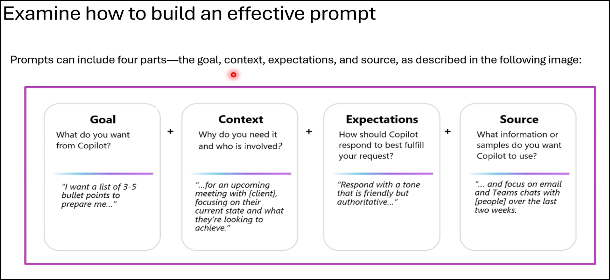

### $${\color{darkorange}Lecture 14 - Prompt \space Engineering \space Techniques \space CoT, \space Few \space Shot \space etc.}$$

#### Zero Shot and Few Shot Prompting:
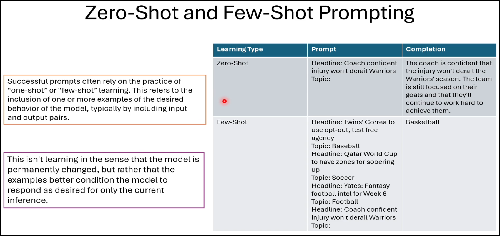

#### Chain of Thought Prompting:
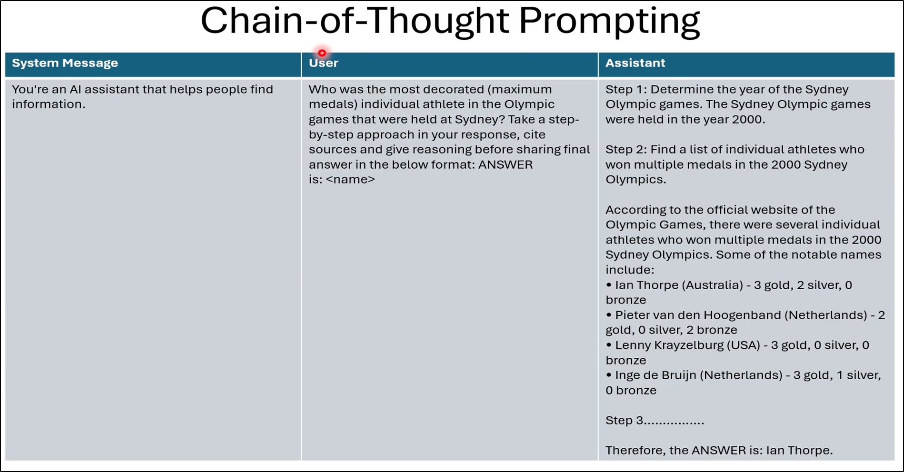

### $${\color{darkorange}Lecture 15 - Introduction \space To \space the \space Microsoft \space Foundary \space SDK}$$
#### What is Microsoft Foundary SDK:
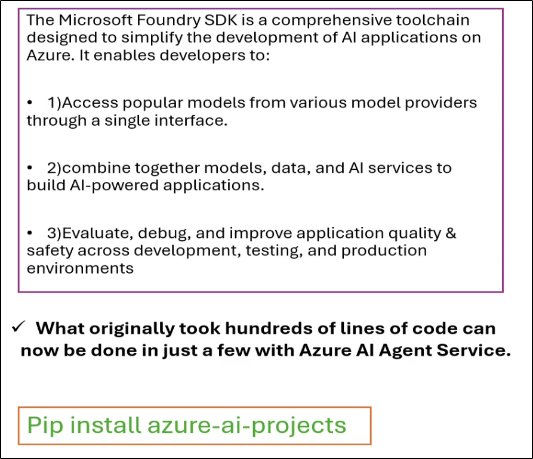

### $${\color{darkorange}Lecture 17 - Introduction \space To \space MCP \space Servers}$$
#### What is MCP (Model COntext Protocol):
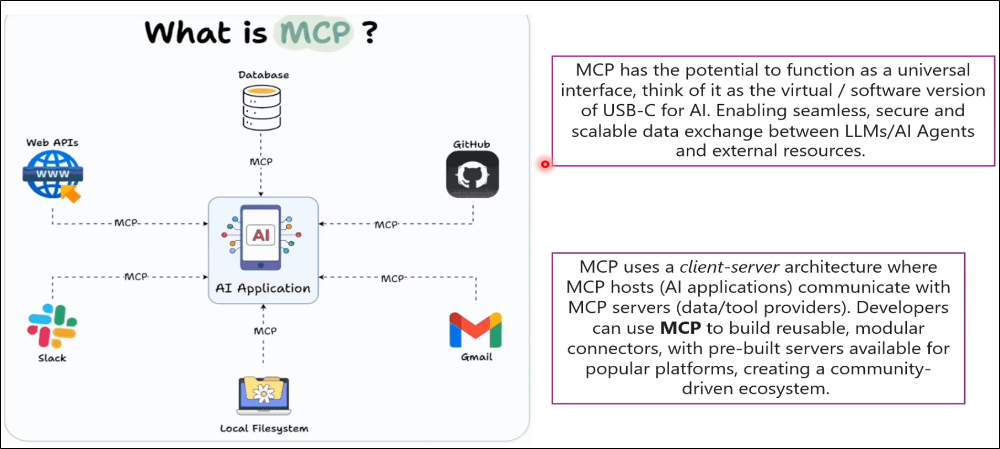

#### Types of MCP servers:
Server that run locally (virtually) within you local system are known as local MCP server, e.g., you can refer to the MCP agent for the "Local Filesystem" in the above image.
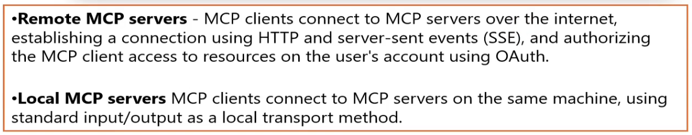

#### Understanding in simple terms:
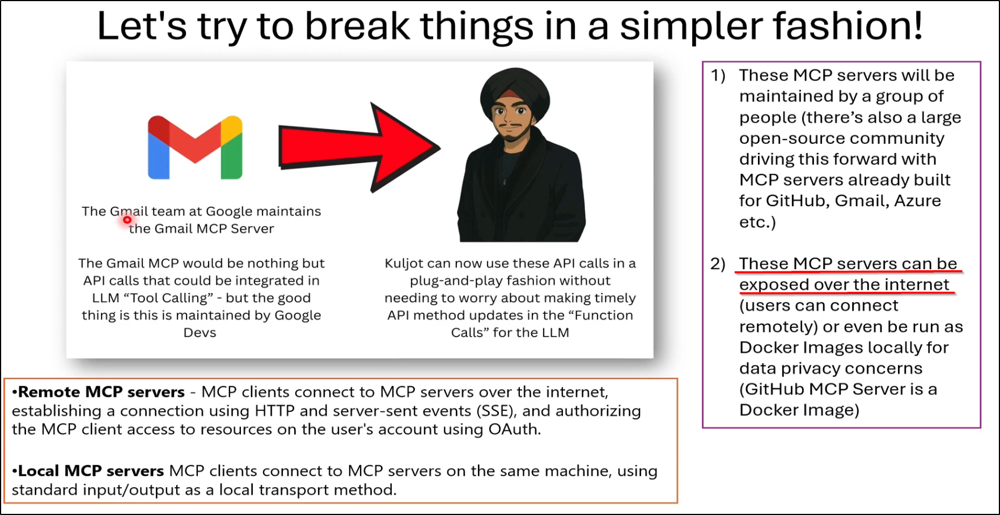

### $${\color{darkorange}Lecture 20 - Introduction \space To \space A2A \space (Agent-to-Agent) \space Protcol}$$
#### A2A Protocol:
<ul>
  <li>A2A enables Agent to talk to other agents,  not just API's or tools</li>
  <li>A standardized protocol that allows AI agents to communicate seamlessly, regardless of their underlying frameworks.</li>
</ul>

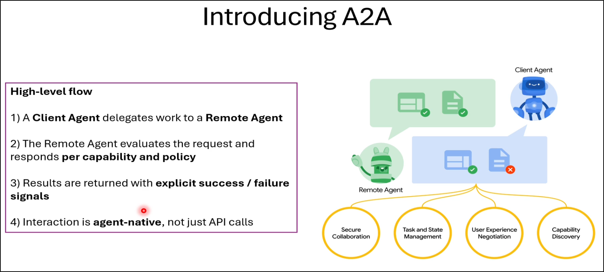

#### Client and Remote Agents:
<ul>
  <li>Client Agent: A personal assistant that delegates tasks to other agents.</li>
  <li>Remote Agent: An agent that receives and executes tasks delegated by the client agent (e.g., an Airbnb agent).</li>
</ul>

#### Communication Evaluation:
A2A enables agents to evaluate requests and responses based on their specific capabilities and policies, ensuring effective interaction.

#### Model Context Protocol (MCP):
While A2A serves as an interoperable layer, MCP provides the necessary tools and plugins for agents. A2A works in conjunction with MCP rather than replacing it.

#### Open Interoperable Agent Ecosystem:
The combined use of A2A and MCP fosters a more functional and collaborative environment for AI agents.

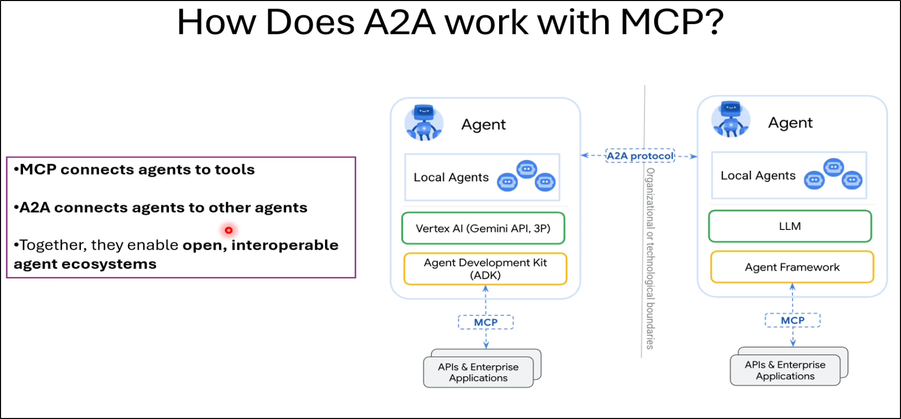

### $${\color{darkorange}Lecture 21 - Understanding \space Fine-Tuning \space a \space LLM}$$
#### What is Fine-Tuning:
<ul><li>The Process of adapting a pre-trained Large Language Model (LLM) using additional data is know as finne-tuning</li></ul>

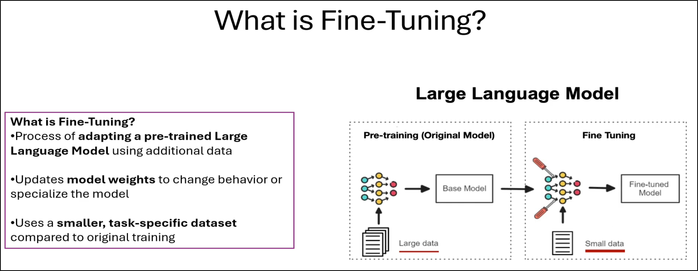

##### Do's and Dont's for fine tuning  the LLM model:
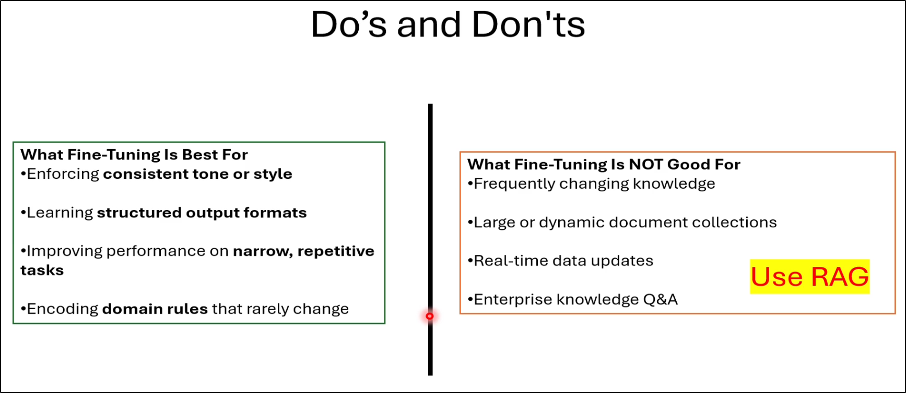

##### Fine-Tuning vs Retrival Augumented Genration (RAG):
<ul>
<li>RAG is ment for creating a chat bot or enterprise knowledge, i.e., the knowledges that changes continously.</li>
<li>Fine-tuning is ment for domain specific narrow tasks.</li>
</ul>

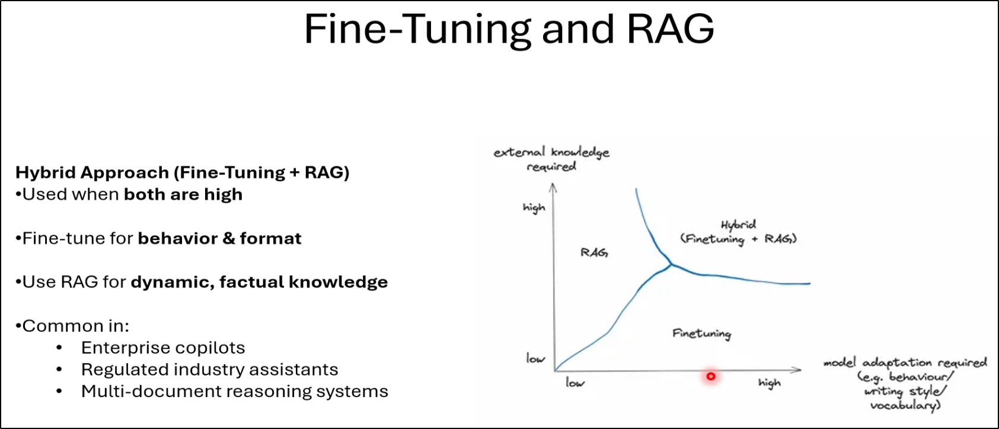

#### Summary for FIne-Tuning:
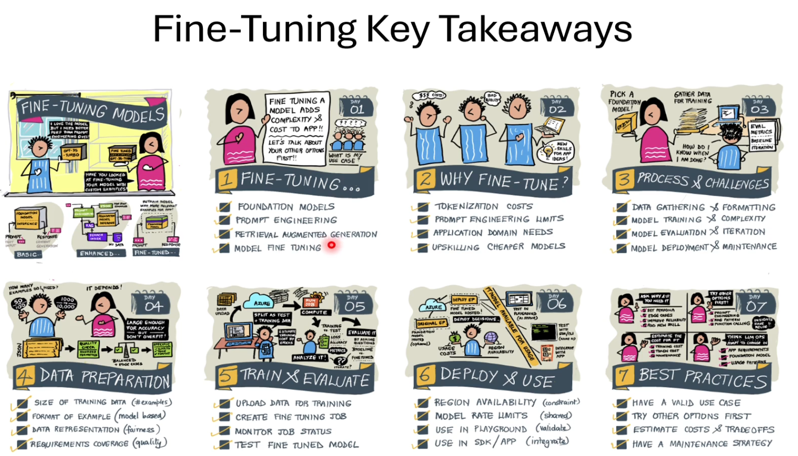

### $${\color{darkorange}Lecture 23 - Understanding \space AI \space agent \space and \space Red \space Teaming}$$
#### What is Red Teaming:
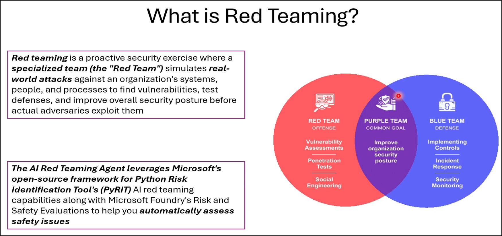

### $${\color{darkorange}Lecture 25 - Introduction \space to \space Microsoft \space Agent \space Framework \space (MAF)}$$
#### Microsoft Agent Framework (MAF):
<ul>
  <li>A framework designed for building AI agents with a focus on interoperability and security.</li>
</ul>

#### &emsp; Foundational Pillars of MAF:
<ul>
  <ul>
    <li><b>Open Standards Foundation:</b> Ensures interoperability and essential protocol support.</li>
    <li><b>Pipeline for Research:</b> Combines features from Autogen and Semantic Kernel SDK for R&D.</li>
    <li><b>Extensibility and Community-Driven Design:</b> The framework is modular and open-source for adaptability.</li>
    <li><b>Enterprise Readiness:</b>  Built for production with observability, security compliance, and durability.</li>
  </ul>
</ul>

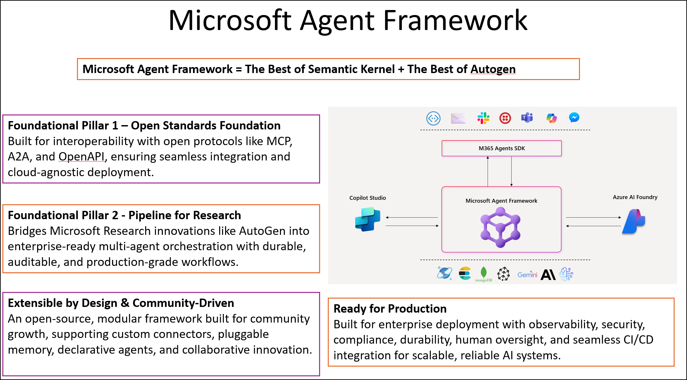

#### The Open Agentic Web:
<ul>
  <li><b>Interoperability and Cohesion:</b> Effective communication among agents requires a shared common language and protocols like Model Context Protocol (MCP).</li>
  <li><b>Complexity and Memory:</b> Agents need memory and reasoning to manage complex tasks and work in multi-agent environments.</li>
  <li><b>Security and Trust:</b> Agents must establish secure interactions with verifiable identities using standards such as OpenID Connect and JSON Web Tokens.</li>
  <li><b>Discovery Management:</b> Similar to directories on the web, a catalog for agents is essential for effective discovery and management.</li>
</ul>

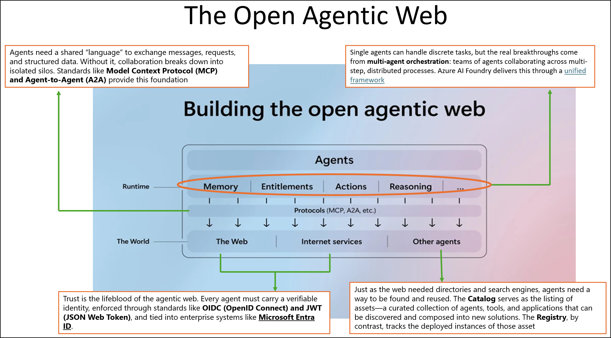

#### Types of Agents:
<ul>
  <li><b>Foundry-tied Agents: </b> Integrated with Microsoft Foundry for improved identity management.</li>
  <li><b>Standalone Agents: </b> Operate independently, without cloud integration.</li>
</ul>

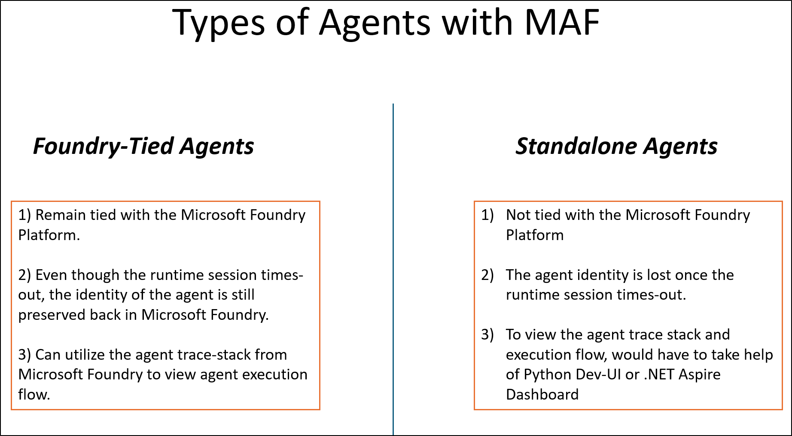

#### Agent Execution Process:
User queries are processed through a loop involving large language models and tools to fulfill user intents effectively.

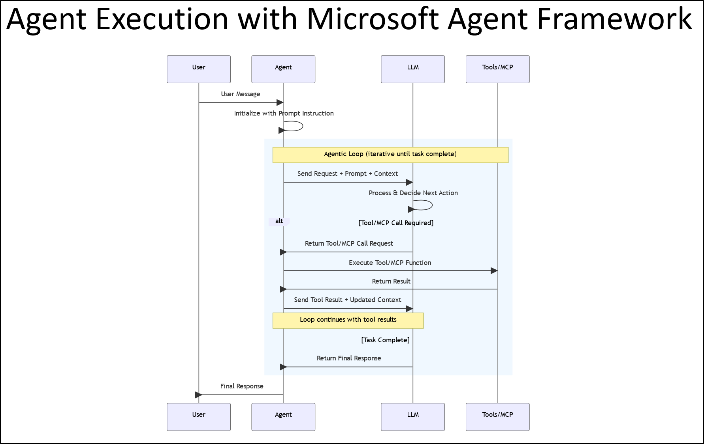

#### Workflow Building Capabilities:
Illustrates how agents can execute tasks in parallel, sequentially, or conditionally.

### $${\color{darkorange}Lecture 31 - Introduction \space to \space Microsoft \space Prompt \space Flow }$$
#### Microsoft Prompt Flow
Microsoft Prompt Flow, a tool aimed at streamlining the development cycle for AI applications using large language models. 

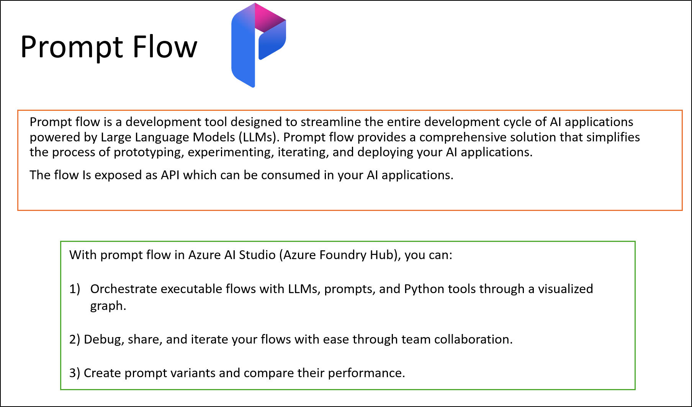
<ul>
  <li>Prompt Flow serves as a generative AI microservice for both low-code developers and business users to prototype solutions, requiring only a basic understanding of Python.</li>
  <li>Execution logic in Prompt Flow must be written in Python, as it operates exclusively within a Python runtime. However, the microservice can be accessed via APIs in any language that supports HTTP client libraries.</li>
  <li>Prompt Flow simplifies prototyping, experimenting, iterating, and deploying AI applications through its comprehensive ecosystem. Users can visualize their microservice's functionality graphically, aiding error identification and debugging.</li>
  <li>The tool supports both pre-deployment and post-deployment evaluations, allowing developers to assess user interactions and performance before and after deployment.</li>
  <li>The quality of prompts significantly influences application performance.</li>
  &emsp; Two main components of Prompt Flow:
  <ul>
    <li>The prompt component for instructing the large language model</li>
    <li>The Python component for custom logic and API calls.</li>
  </ul>
  <li>Prompt Flow is scalable and can integrate generative AI capabilities into both legacy and modern applications through API consumption.</li>
</ul>

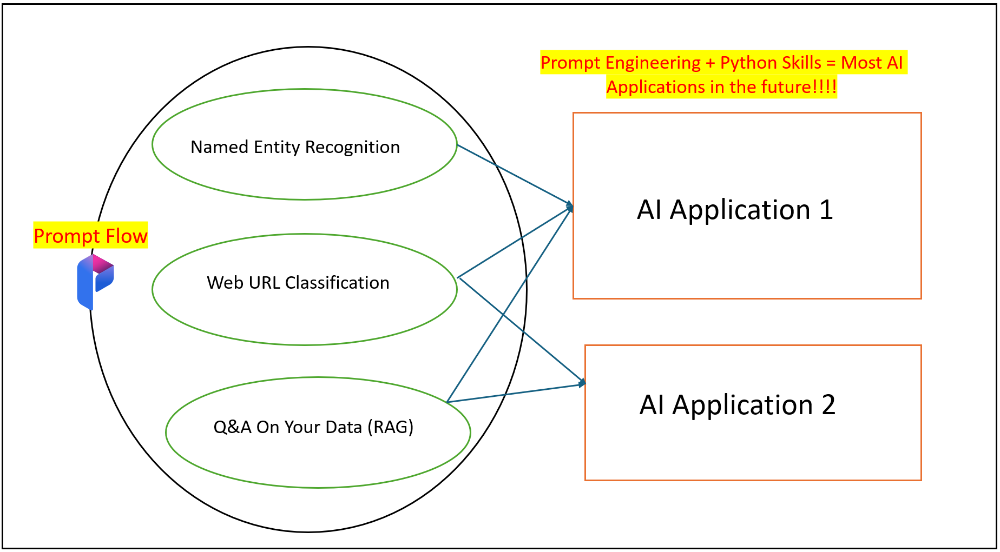

## $${\color{yellowgreen}Section-4 - GenAI \space Developement \space with \space Azure \space OpenAI}$$

## $${\color{yellowgreen}Section-5 - Develop \space Natural \space Language \space Solutions \space in \space Azure}$$

### $${\color{darkorange}Lecture 38 - Introduction \space to \space Natural \space Language \space Services \space Capablities}$$
The Azure Language Service capabilities focus on two primary utilization methods: 
1. Pre-configured Features:
<ul>
  <ul>
    <li><b>Language Detection:</b> Identifies the language of a given text.</li>
    <li><b>Key Phrase Extraction:</b> Extracts essential phrases from the text.</li>
    <li><b>Sentiment Analysis:</b> Analyzes the sentiment expressed in the text.</li>
    <li><b>Named Entity Recognition (NER):</b> Identifies keywords and their associated entities, such as people and locations.</li>
    <li><b>Entity Linking:</b> Establishes relationships between recognized entities and provides sources for further information (e.g., Wikipedia).</li>
    <li><b>Summarization Tools:</b> Provides summaries of text, though less effective than large models like GPT.</li>
    <li><b>Detection of Personally Identifiable Information (PII):</b> Redacts sensitive data to ensure compliance with regulations like GDPR and HIPAA.</li>
  </ul>
</ul>
2. Custom Solutions:
<ul>
  <ul>
    <li>Users can create custom models for NER, develop Q&A systems, and implement conversational language understanding to interpret user intent.</li>
  </ul>
</ul>
3. Accessing the Azure Language Service:
<ul>
  <ul>
    <li>Deploying a Microsoft Foundry Hub for an AI multi-service account.</li>
    <li>Provisioning the service separately in the Azure portal.</li>
  </ul>
</ul>

### $${\color{darkorange}Lecture 40 - Conversation \space Language \space Understanding \space (CLU)}$$
<ul>
  <li><b>Concept of CLU:</b> A CLU solution determines the user's intent behind queries to route requests effectively.</li>
  <li><b>Flow of a CLU Model:</b> Natural language input is processed to derive meaning through a tailored language model.</li>
  <li><b>Key Components:</b></li>
  <ul>
    <li><b>Natural Language Processing (NLP):</b> Breaks down user input into tokens.</li>
    <li><b>Natural Language Understanding (NLU):</b> Interprets these tokens to identify the intent behind the query.</li>
    <li><b>See Image 21.</b></li>
  </ul>
  <li><b>Utterances:</b> Phrases that correspond to specific intents (e.g., "What time is it?" relates to the intent "get time").</li>
  <li><b>See Image 22.</b></li>
  <li><b>Entities:</b> Key phrases that provide context, which can be classified into:</li>
  <ul>
    <li><b>Learned Entities:</b> Trained through various examples.</li>
    <li><b>List Entities:</b> Contain a fixed set of values (e.g., days of the week).</li>
    <li><b>Prebuilt Entities:</b> Recognized by the model without extra training (e.g., email addresses).</li>
    <li><b>See Image 23.</b></li>
  </ul>
</ul>

  
   
  <em><b>IMAGE-21</b></em>

  
   
  <em><b>IMAGE-22</b></em>

  
   
  <em><b>IMAGE-23</b></em>

### $${\color{darkorange}Lecture 42 - Question \space and \space Answer \space Solutions \space with \space Azure \space Language \space Services}$$
#### Q&A vs Language Understanding

  
   
  <em><b>IMAGE-24</b></em>

### $${\color{darkorange}Lecture 46 - Introduction \space to \space Custom \space Classification \space Models}$$
#### Types of Classification Models

  
   
  <em><b>IMAGE-25</b></em>

#### Model Development Lifecycle

  
   
  <em><b>IMAGE-26</b></em>

#### Model Eval Metrics

  
   
  <em><b>IMAGE-27</b></em>

### $${\color{darkorange}Lecture 51 - Introduction \space to \space Azure \space Translator \space Service}$$
#### Azure Translator Service Capabilities:

  
   
  <em><b>IMAGE-28</b></em>

#### Custom Translation Service:

  
   
  <em><b>IMAGE-29</b></em>

### $${\color{darkorange}Lecture 54 - Introduction \space to \space Azure \space Speech \space Service}$$
#### Azure Speech Service Capabilities:

  
   
  <em><b>IMAGE-30</b></em>

#### Speech to Text API workflow:

  
   
  <em><b>IMAGE-31</b></em>

#### Text to Speech API workflow:

  
   
  <em><b>IMAGE-32</b></em>

#### Speech Synthesis Markup Language:

  
   
  <em><b>IMAGE-33</b></em>

